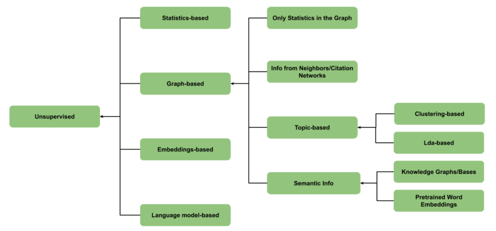
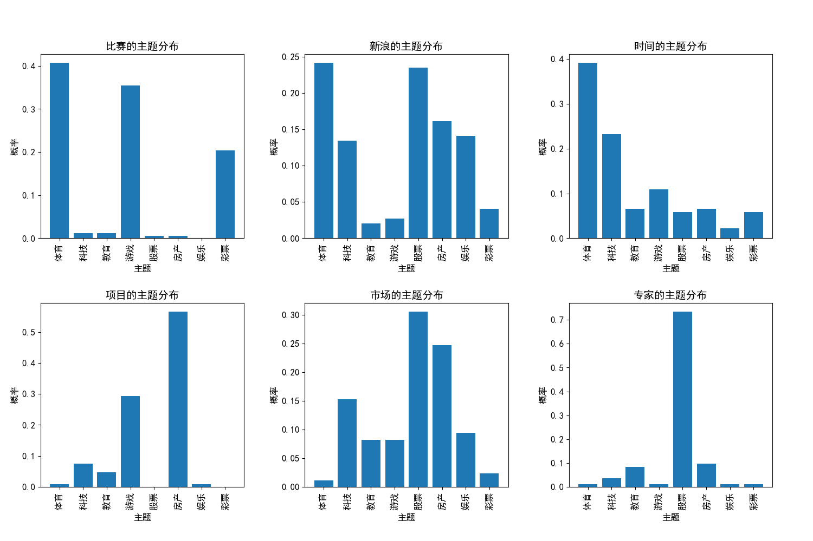

# Keyphrase Extraction Algorithm

基于**无监督学习**的中文关键词抽取（Chinese Keyphrase Extraction）

- 基于统计：TF-IDF，YAKE

- 基于图：
  - 基于统计：TextRank，SingleRank，SGRank，PositionRank
  - 基于类似文件/引文网络：ExpandRank，CiteTextRank
  - 基于主题：
    - 基于聚类：TopicRank（TR）
  
    - 基于LDA：TPR（TopicPageRank）， Single TPR，Salience Rank
      - 英文Keyphrase Extraction参考：https://github.com/JackHCC/Keyphrase-Extraction
  
  - 基于语义方法：
    - 基于知识图谱：WikiRank
    - 基于预训练词嵌入： theme-weighted PageRank 
  
- 基于嵌入：EmbedRank， Reference Vector Algorithm (RVA)，SIFRank
- 基于语言模型：N-gram



## Introduction

### Statistics-based

| Algorithm |                            Intro                             | Year |                             ref                              |
| :-------: | :----------------------------------------------------------: | :--: | :----------------------------------------------------------: |
|  TF-IDF   | 一种用于信息检索与数据挖掘的常用加权技术，常用于挖掘文章中的关键词 | 1972 |     [link](https://en.wikipedia.org/wiki/Tf%E2%80%93idf)     |
|   YAKE    |     首次将主题（Topic）信息整合到 PageRank 计算的公式中      | 2018 | [paper](https://repositorio.inesctec.pt/server/api/core/bitstreams/ef121a01-a0a6-4be8-945d-3324a58fc944/content) |

### Graph-based

|     Algorithm      |                            Intro                             | Year |                             ref                              |
| :----------------: | :----------------------------------------------------------: | :--: | :----------------------------------------------------------: |
|      TextRank      |           基于统计，将PageRank应用于文本关键词抽取           | 2004 |        [paper](https://aclanthology.org/W04-3252.pdf)        |
|     SingleRank     |       基于统计，TextRank的一个扩展，它将权重合并到边上       | 2008 | [paper](https://www.aaai.org/Papers/AAAI/2008/AAAI08-136.pdf) |
|       SGRank       |              基于统计，利用了统计和单词共现信息              | 2015 |        [paper](https://aclanthology.org/S15-1013.pdf)        |
| PositionRank（PR） |   基于统计，利用了单词-单词共现及其在文本中的相应位置信息    | 2017 |        [paper](https://aclanthology.org/P17-1102.pdf)        |
|     ExpandRank     | 基于类似文件/引文网络，SingleRank扩展，考虑了从相邻文档到目标文档的信息 | 2008 | [paper](https://www.aaai.org/Papers/AAAI/2008/AAAI08-136.pdf) |
|    CiteTextRank    | 基于类似文件/引文网络，通过引文网络找到与目标文档更相关的知识背景 | 2014 | [paper](https://ojs.aaai.org/index.php/AAAI/article/view/8946) |
|  TopicRank（TR）   |     基于主题，使用层次聚集聚类将候选短语分组为单独的主题     | 2013 | [paper](https://hal.archives-ouvertes.fr/hal-00917969/document) |
|        TPR         | 基于主题，首次将主题（Topic）信息整合到 PageRank 计算的公式中 | 2010 |        [paper](https://aclanthology.org/D10-1036.pdf)        |
|     Single TPR     |           基于主题，单词迭代计算的Topic  PageRank            | 2015 | [paper](https://biblio.ugent.be/publication/5974208/file/5974209.pdf) |
|   Salience Rank    |            基于主题，引入显著性的Topic  PageRank             | 2017 |         [paper](https://aclanthology.org/P17-2084/)          |
|      WikiRank      |      基于语义，构建一个语义图，试图将语义与文本联系起来      | 2018 |        [paper](https://arxiv.org/pdf/1803.09000.pdf)         |

### Embedding Based

|            Algorithm             |                            Intro                             | Year |                             ref                              |
| :------------------------------: | :----------------------------------------------------------: | :--: | :----------------------------------------------------------: |
|            EmbedRank             | 使用句子嵌入（Doc2Vec或Sent2vec）在同一高维向量空间中表示候选短语和文档 | 2018 |        [paper](https://arxiv.org/pdf/1801.04470.pdf)         |
| Reference Vector Algorithm (RVA) | 使用局部单词嵌入/语义（Glove），即从考虑中的单个文档中训练的嵌入 | 2018 |        [paper](https://arxiv.org/pdf/1710.07503.pdf)         |
|         SIFRank/SIFRank+         |          基于预训练语言模型的无监督关键词提取新基线          | 2020 | [paper](https://ieeexplore.ieee.org/stamp/stamp.jsp?tp=&arnumber=8954611) |

## Dependencies
```txt
sklearn
matplotlib
nltk==3.6.7
gensim==3.8.3
scipy==1.5.4
jieba==0.42.1
networkx==2.5
numpy==1.19.5
xlrd==1.2.0
openpyxl==3.0.7
pandas==1.1.5
matplotlib==3.3.4
thulac==0.2.1
overrides==3.1.0
elmoformanylangs
```

## File

- `main.py`：主程序入口
- `process.py`：数据预处理和配置加载
- `lda.py`：潜在迪利克雷分配
- `ranks.py`：Topic PageRank算法实现
- `utils.py`：工具函数
- `distribution_statistics.py`：关键词输出结果统计
- `model/`：基于嵌入的算法模型目录

## Data

本项目采用新浪新闻8个领域（体育，娱乐，彩票，房产，教育，游戏，科技，股票）的新闻数据共800条作为实验数据。

数据集位于`data/data.xlsx`下，由两列组成，第一列content存放新闻标题和新闻的正文内容，第二列是type是该新闻的话题类型。

在模型训练过程只需要利用excel文件中的`content`列，第二列是根据提取的关键词来衡量提取的准确性。

### 如何使用自己的数据

按照`data.xlsx`的数据格式放置你的数据，只需要`content`列即可。

## Config

`config`目录下可以配置：

- `jieba`分词库的自定义词典`jieba_user_dict.txt`，具体参考：[Jieba](https://github.com/fxsjy/jieba#%E8%BD%BD%E5%85%A5%E8%AF%8D%E5%85%B8)
- 添加停用词（stopwords）`stop_words.txt`
- 添加词性配置`POS_dict.txt`，即设置提取最终关键词的词性筛选，具体词性表参考：[词性表](https://blog.csdn.net/Yellow_python/article/details/83991967)

如果需要使用`SIF_rank`算法，需要加载`elmo`模型和`thulac`模型：

- elmo模型的下载地址：[这里](https://github.com/HIT-SCIR/ELMoForManyLangs)，具体放置参考：[这里](./model/SIF_rank/zhs.model/README.md)
- thulac模型下载地址：[这里](http://thulac.thunlp.org/)，具体放置参考：[这里](./model/SIF_rank/thulac.models/README.md)
- 百度网盘备份：[这里](https://pan.baidu.com/s/1CblGMgsuyVLBfHZidDvuig?pwd=jack )，提取码：jack

## Usage

### Install

```shell
git clone https://github.com/JackHCC/Chinese-Keyphrase-Extraction.git

cd Chinese-Keyphrase-Extraction

pip install -r requirements.txt
```

### Run

```shell
# TextRank
python main.py --alg text_rank
# PositionRank
python main.py --alg position_rank
# TR
python main.py --alg tr
# TPR
python main.py --alg tpr
# Single TPR
python main.py --alg single_tpr
# Salience Rank
python main.py
# EmbedRank
python main.py --alg embed_rank
# SIFRank(适合单条数据抽取)
python main.py --alg SIF_rank
```

### Custom

```shell
python main.py --alg salience_rank --data ./data/data.xlsx --topic_num 10 --top_k 20 --alpha 0.2 --lambda_ 0.7
```

- `alg`：选择`Rank`算法，选项包括：`text_rank`, `SG_rank`, `position_rank`, `expand_rank`, `tr`, `tpr`, `single_tpr`, `salience_rank`, `embed_rank`, `SIF_rank`
- `data`：训练数据集路径
- `topic_num`：确定潜在迪利克雷分配的主题数量
- `top_k`：每个文档提取关键词的数量
- `alpha`：`salience_rank`算法的超参数，用于控制语料库特异性和话题特异性之间的权衡，取值位于0到1之间，越趋近于1，话题特异性越明显，越趋近于0，语料库特异性越明显
- `lambda_`：基于图的Rank算法中`PageRank`的超参数，取值位于0到1之间
- `window_size`：`PositionRank`算法的参数，共现矩阵的共现窗口大小
- `max_d`：`TopicRank`算法层次聚类的最大距离
- `plus`：`SIFRank`算法参数，`True`表示使用`SIFRank+`，`False`表示使用`SIFRank`

### Train Your own Embedding

#### EmbedRank

如果使用`EmbedRank`算法，这里采用`gensim`的[Doc2Vec](https://radimrehurek.com/gensim/auto_examples/tutorials/run_doc2vec_lee.html)训练嵌入矩阵，如果使用你自己的数据，在运行该算法之前，你应该优先执行以下语句：

```shell
cd model
# Train Doc2Vec to get Embedding Matrix
python embed_rank_train.py
```

训练得到的模型存储在`./model/embed_rank`目录下。

然后回到上一级目录执行：

```shell
cd ..
# EmbedRank
python main.py --alg embed_rank
```

## Result

### RunTime

- 包括加载数据到关键词抽取完成

|     Algorithm      | Time(s) |
| :----------------: | :-----: |
|      TextRank      |   90    |
|       SGRank       |    -    |
| PositionRank（PR） |   142   |
|     ExpandRank     |    -    |
|  TopicRank（TR）   |   212   |
|        TPR         |   192   |
|     Single TPR     |   128   |
|   Salience Rank    |   108   |
|     EmbedRank      |   235   |
|      SIF_rank      |   ++    |

### Keyphrase Extract

- TextRank前十条数据提取关键词结果

```
0  :  训练;大雨;球员;队员;队伍;雨水;热身赛;事情;球队;全队;国奥;影响;情况;比赛;伤病
1  :  战术;姑娘;首战;比赛;过程;记者;主帅;交锋;信心;剪辑;将士;软肋;世界杯;夫杯;遭遇
2  :  冠军;活动;女士;文静;游戏;抽奖;俱乐部;眼镜;大奖;特等奖;奖品;现场;环节;教练;球队
3  :  俱乐部;球员;工资;危机;宏运;球队;奖金;管理;老队员;教练;笑里藏刀;前提;集体;集团;经验
4  :  警方;立案侦查;总局;产业;电话;足球;外界;消息;公安部门;依法;中体;主席;裁判;检察机关;委员会
5  :  比赛;鹿队;机会;命中率;队员;联赛;调整;开赛;压力;包袱;外援;主场;状态;体育讯;金隅
6  :  火箭;球队;比赛;原因;时间;效率;开局;事实;教练组;变化;轨道;过程;漫长;判断能力;时机
7  :  胜利;球队;队友;火箭;篮板;比赛;关键;垫底;句式;小牛;新浪;战绩;体育讯;活塞;时间
8  :  火箭;交易;活塞;球队;球员;情况;筹码;价值;命运;市场;续约;掘金;遭遇;球星;核心
9  :  湖人;比赛;球队;后卫;揭幕战;沙农;时间;出场;阵容;板凳;火力;外线;念头;贡献;证明
10  :  公牛;球员;球队;教练;数据;比赛;能力;体系;主教练;命中率;交流;研究;水平;记者;小时
```

- 最终提取结果写入excel表格中，具体在`result`目录下。

### Topic Distribution

获取关键词抽取结果的主题分布，执行下面语句（前提是先根据对应算法生成了对应的结果）

```shell
python distribution_statistics.py
```

`Salience Rank`算法抽取关键词Top 6的主题分布结果：



## FAQ

如果你需要使用`SIF_rank`算法，该模块用到了`nltk`包，如果你无法根据该包获取`stopwords`或者关于该包的一些其他问题，你可以：

- 前往https://github.com/nltk/nltk_data，下载该仓库
- 通过比较可以发现压缩包中的文件结构和`%appdata%/Roaming/nltk_data`下的目录结构是一致的，所以把`packages`里面的东西复制到`%appdata%/Roaming/nltk_data`里面就可以了

## Reference

  - Papagiannopoulou E, Tsoumakas G. A review of keyphrase extraction.
